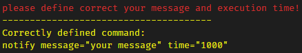
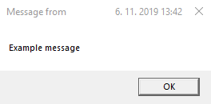

# os-notification
Easily create notify message in your defined time. It supports apple, windows and linux operation systems. It has support for MacOS, Windows and Linux.


<hr>

## Installation
```
npm i os-notification -g
```

## Example running:
```
notify message="Example message"
```
default execute time is 0, you can define time when your message has to show, example 10sec like this:
```
notify message="Example message" time="10000"
```

## You can use this package for your next solution like this:
```js
const { notify } = require('os-notification')
notify(
  "Example message", // message,
  `${10 * 1000}` // execute time 10sec
)
```

## Expected incorrect result will be show in your console like this:
<br>

## Expected correct result will show your message:
<br>
